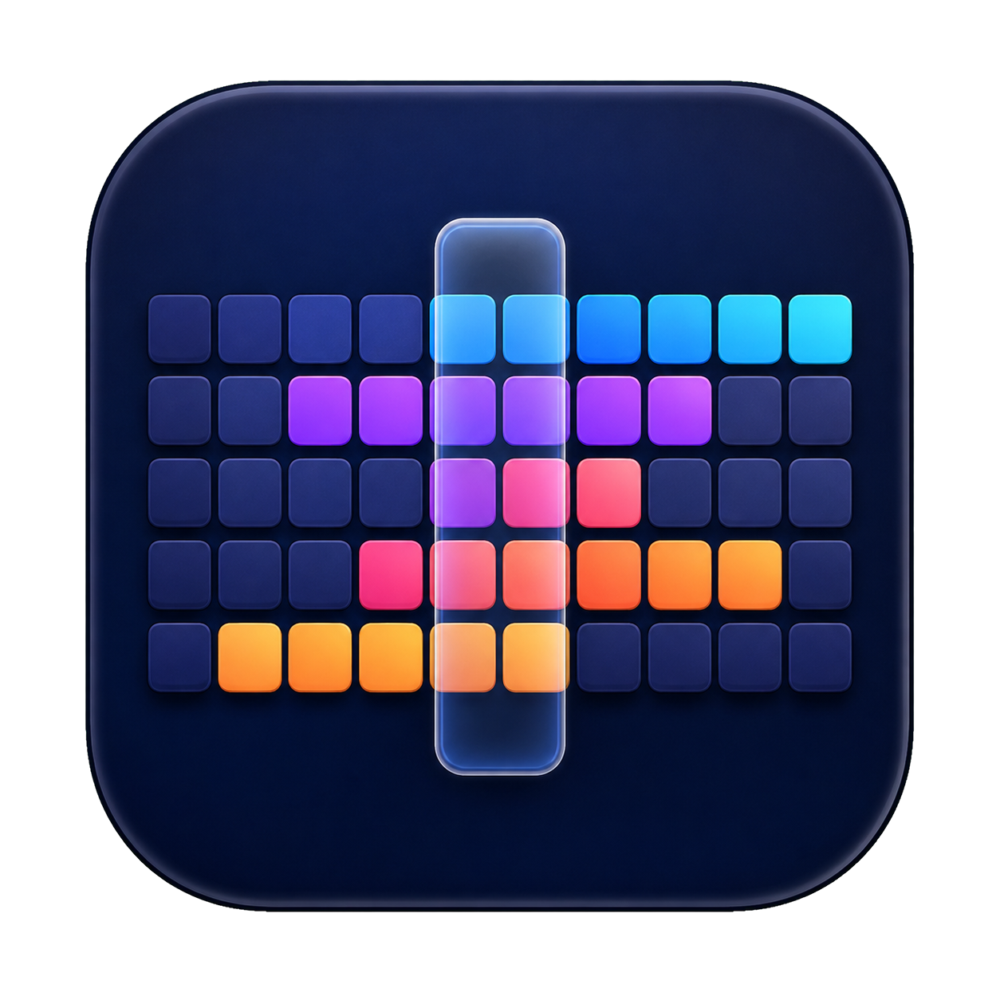

<p align="center">
  
</p>

<h1 align="center">Zonely</h1>

<p align="center">A focused macOS menu-bar utility for finding humane meeting times across time zones.</p>

<p align="center">
  <a href="https://github.com/adithyaakrishna/zonely/actions/workflows/ci.yml"></a>
  <a href="https://github.com/adithyaakrishna/zonely/releases"></a>
  <a href="LICENSE"></a>
</p>

Zonely turns the working day in each city into one compact timeline. Move the glass selector to compare local times instantly, reorder locations as your priorities change, or let Zonely find the nearest time that works for everyone.

## Features

- Lives entirely in the macOS menu bar.
- Shows working, edge, and off-hours across up to five time zones.
- Supports fractional UTC offsets such as India Standard Time.
- Drag-to-reorder timezone rows with a synchronized timeline preview.
- Finds the nearest meeting time with the best overlap.
- Persists timezone selections locally between launches.
- Includes native pointer, keyboard, and accessibility behavior.

## Install

Zonely requires macOS 14 or later.

1. Download the latest signed and notarized DMG from [Releases](https://github.com/adithyaakrishna/zonely/releases).
2. Open the DMG and drag **Zonely** into **Applications**.
3. Launch Zonely. Its globe-and-selector icon appears in the menu bar.

Release downloads are universal binaries for Apple silicon and Intel Macs. SHA-256 checksum files are published beside every DMG and ZIP.

## Use

- Click the menu-bar icon to open or close Zonely.
- Drag horizontally across the timeline to change the selected UTC hour.
- Drag the six-dot handle beside a city to reorder it.
- Select **+** to add, remove, or search time zones. Zonely supports one to five locations.
- Select **Find best time** to jump to the strongest working-hours overlap.
- Right-click the menu-bar icon to reset the selected time or quit.

## Develop

The project is a native Swift Package Manager app with no third-party runtime dependencies.

```bash
git clone git@github.com:adithyaakrishna/zonely.git
cd zonely
swift test
./script/build_and_run.sh
```

Useful checks:

```bash
swift format lint --recursive --strict Sources Tests Package.swift
bash -n script/*.sh
swift test --parallel
```

Build a local universal DMG and ZIP:

```bash
VERSION=0.1.0 BUILD_NUMBER=1 ./script/build_distribution.sh
VERSION=0.1.0 ./script/verify_distribution.sh
```

Local distribution builds are ad-hoc signed. Public releases are Developer ID signed, notarized by Apple, stapled, Gatekeeper-verified, and published by GitHub Actions.

## Releases

Push a semantic version tag to start the release workflow:

```bash
git tag v1.0.0
git push origin v1.0.0
```

The workflow builds a universal app, signs it with the Developer ID certificate, notarizes and staples both the app and DMG, verifies Gatekeeper acceptance, creates checksums and provenance attestations, then publishes the artifacts to GitHub Releases.

Configure these repository secrets before creating a release tag:

| Secret | Purpose |
| --- | --- |
| `DEVELOPER_ID_CERTIFICATE_BASE64` | Base64-encoded Developer ID Application `.p12` certificate |
| `DEVELOPER_ID_CERTIFICATE_PASSWORD` | Password used when exporting the `.p12` |
| `APPLE_ID` | Apple ID used for notarization |
| `APPLE_TEAM_ID` | Apple Developer Program Team ID |
| `APPLE_APP_SPECIFIC_PASSWORD` | App-specific password for `notarytool` |

To encode the certificate on macOS:

```bash
base64 -i DeveloperIDApplication.p12 | pbcopy
```

The CI workflow runs formatting checks, shell syntax validation, tests, and an unsigned universal distribution build for every pull request and every push to `main`. Dependabot checks GitHub Actions dependencies weekly.

## Privacy

Zonely has no analytics, accounts, or network service. Selected time zones are stored locally using macOS `UserDefaults`.

## License

Zonely is available under the [MIT License](LICENSE).
